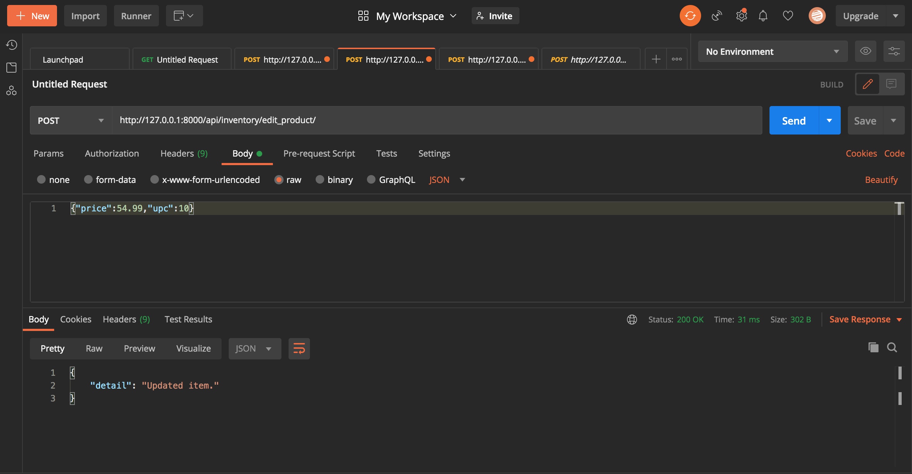

# Inventory-Backend-Challenge

The Inventory Backend Challenge is a Django application that implements CRUD functionality and two more endpoints:
1. Create inventory items
2. Read inventory items
3. Update inventory items
4. Delete inventory items
5. Create warehouses
6. Assign inventory items to warehouses

## Setting up

- [Python 3.7](https://www.python.org/getit/) is required to to run the core server
- [Pipenv](https://pipenv.readthedocs.io/en/latest/install/) is used for managing Python dependency packages

1. Create Python virtual environment and install (dev-)dependency packages
   - This can be done with `pipenv install --dev`
   - The dependencies will be determined from the `Pipfile` file
2. Activate the virtual environment with `pipenv shell`
3. Inside of ./shopify_challenge, apply database migrations with `python manage.py migrate`
   - By default, a SQLite database file called `db.sqlite3` will be used
   - This needs to be done initially, then again whenever database schema migrations are made

## Usage

### Python virtual environment

- Activate the virtual environment with `pipenv shell`
  - This should be done any time you open a new terminal for development
- Deactivate the virtual environment with `deactivate`

### Django development server

- Inside of ./shopify_challenge, start the server with `python manage.py runserver`
- Stop the server with Ctrl+C

## Decisions

To represent an inventory item, I decided on creating a product model that would contain the item's name, description, manufacturer's suggested retail price (MSRP), and universal product code (UPC) which is all identifiable in the logistics chain.

A city is defined by the city's name, the state it is located in, and the zipcode. In the state field, I used two characters to represent the initials of each state instead of the full phrase to avoid duplication or misinputs.

For a warehouse, it would be represented by the warehouse name, the street address, and the city it is in.

Given that the assignment asks to assign an inventory item to a warehouse, stock refers to a specific warehouse containing an amount of a given item.

Check out the file, models.py, located in shopify_challenge/inventory/

## Assumptions

Based on the instructions, we had to view the inventory items. I was not sure if it meant all inventory items or a specific inventory item. I decided to develop two endpoints to account for each case.

I made the assumption that prices and MSRP often change for a product. So for the CRUD functionality I focused on enabling users to change the price of the product rather than changing the name or the description.

I also made the assumption that the logistics chain was all based in North America. So, I used the initials of each state for the field in the city model.

## Using Postman to send requests to the server

You can use [Postman](https://www.postman.com/downloads/) to send a POST request with JSON to some endpoints. To do this, you have to connect to one of the endpoints and set the request to POST. Then under the body tab you want to set the request you are sending as raw JSON. Here is an example:

**Do not forget to include api/inventory/ before the endpoint**

Here are also some of the POST requests I make for each endpoint that you can easily try in Postman after setting up:

/create_product/ | /edit_product/ | /delete_product/ | /create_warehouse/ | /add_to_warehouse/
--- | --- | --- | ---| ---
{"name":"Pokemon Legends Arceus","description":"Some game description that works","price":59.99,"upc":10} | {"price":54.99,"upc":10} | {"upc":10} | {"building_name":"Amazon Warehouse","street_add":"20 Bleeker Street","city":"New York","state":"NY","zipcode":10001} | {"upc":10,"building_name":"Amazon Warehouse","street_add":"20 Bleeker Street","city":"New York","state":"NY","zipcode":10001,"quant":4}

You need to send a GET request to the /list_products/ endpoint to view all inventory items. To do this, you just have to set the request to GET.

On the other hand, for the endpoint /get_product/, you need to send a GET request along with a query to view a specific inventory item. To do this, you set the request to GET. Then at the end of the endpoint include a query such as: ?upc=10. It should look like this: `/get_product/?upc=10`

